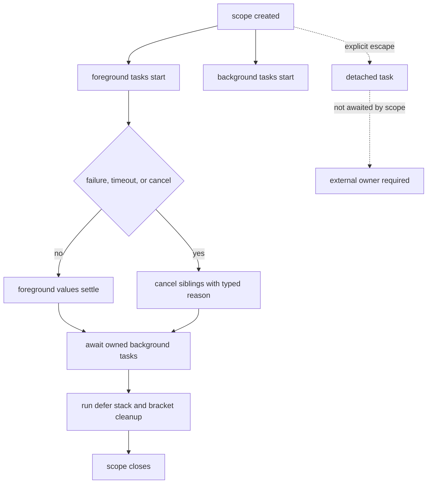

<!--
Author: Admilson B. F. Cossa
SPDX-License-Identifier: Apache-2.0
-->

# WorkIt

Structured concurrency for TypeScript systems that need owned async work:
bounded parallelism, cancellation, cleanup, retries, timeouts, budgets,
backpressure, worker offload, and observable task lifecycles.

Native `Promise` is still the right tool for one asynchronous value. WorkIt is
for the next step: a request, batch, agent run, provider race, stream, or
background operation where related async tasks must live, fail, cancel, and
clean up together.

[](LICENSE)
[](package.json)
[](package.json)
[](#verified-evidence)
[](benchmarks/articles/)
[](https://www.bestpractices.dev/projects/12807)

## Install

```sh
npm install @workit/core
```

WorkIt targets Node.js server runtimes today. Browser and edge runtimes resolve
to an explicit unsupported-runtime boundary.

## Quick Start

```ts
import { work } from "@workit/core";

const doubled = await work([1, 2, 3])
  .inParallel(2)
  .do(async (value, _ctx) => value * 2);
```

The context parameter is available when the task needs cancellation, progress,
budgets, or scoped resources. It can be ignored for plain transformations.

## Why Ownership Matters

Consider this batch helper:

```ts
type BatchEvent<T> =
  | { type: "item:started"; item: T; attempt: number }
  | { type: "item:retried"; item: T; attempt: number; error: unknown }
  | { type: "item:completed"; item: T };

type BatchOptions<T, R> = {
  concurrency: number;
  retries: number;
  timeoutMs: number;
  signal: AbortSignal;
  events: { emit(event: BatchEvent<T>): void };
  run: (item: T, options: { signal: AbortSignal }) => Promise<R>;
};

function backoffMs(attempt: number): number {
  return Math.min(1000 * 2 ** (attempt - 1), 10_000);
}

function sleep(ms: number, signal?: AbortSignal): Promise<void> {
  if (signal?.aborted) return Promise.reject(signal.reason);

  return new Promise((resolve, reject) => {
    let settled = false;

    const finish = (): void => {
      if (settled) return;
      settled = true;
      signal?.removeEventListener("abort", abort);
      resolve();
    };

    const abort = (): void => {
      if (settled) return;
      settled = true;
      clearTimeout(timer);
      reject(signal?.reason);
    };

    const timer = setTimeout(finish, ms);
    signal?.addEventListener("abort", abort, { once: true });
  });
}

async function runBatch<T, R>(
  items: readonly T[],
  options: BatchOptions<T, R>
): Promise<R[]> {
  const results = new Array<R>(items.length);
  let nextIndex = 0;

  async function worker(): Promise<void> {
    while (!options.signal.aborted) {
      const index = nextIndex++;
      if (index >= items.length) return;

      const item = items[index];
      for (let attempt = 1; attempt <= options.retries + 1; attempt++) {
        const timeout = AbortSignal.timeout(options.timeoutMs);
        const signal = AbortSignal.any([options.signal, timeout]);

        try {
          options.events.emit({ type: "item:started", item, attempt });
          results[index] = await options.run(item, { signal });
          options.events.emit({ type: "item:completed", item });
          break;
        } catch (error) {
          if (attempt > options.retries || options.signal.aborted) throw error;
          options.events.emit({ type: "item:retried", item, attempt, error });
          await sleep(backoffMs(attempt), options.signal);
        }
      }
    }
  }

  await Promise.all(
    Array.from({ length: options.concurrency }, () => worker())
  );

  return results;
}
```

It covers bounded parallelism, timeout, parent cancellation, ordered results,
typed events, and retry backoff. The lifecycle is still split across the queue,
timeout signals, retry loop, event sink, and caller. Adding sibling
cancellation, cleanup, budgets, partial results, or diagnostics extends the
same ownership protocol in several places.

With WorkIt, the ownership boundary is the API:

```ts
import { work } from "@workit/core";

const results = await work(items)
  .inParallel(8)
  .withRetry(3)
  .withTimeout("5s")
  .do(async (item, ctx) => {
    ctx.report({ message: `processing ${item.id}` });
    return apiCall(item, { signal: ctx.signal });
  });
```

This gives the batch one lifecycle contract:

- at most 8 items run at once
- transient failures retry with cancel-aware backoff
- each item has a 5 second timeout
- every task receives the same cancellation model through `ctx.signal`
- progress is a typed runtime event
- queued and active work stop together when the owner is cancelled

## What WorkIt Replaces

WorkIt does not replace promises as values. It replaces repeated lifecycle
orchestration around promises.

| Existing pattern | Real limitation | Ownership contract | WorkIt primitive |
|---|---|---:|---|
| Hand-written concurrency queue | Queue, retry, timeout, and caller cancellation each own part of the lifecycle | no single owner | `work().inParallel()` / `run.pool()` |
| Manual scope object with cancellation tokens | Works until every new feature must reimplement the same lifecycle rules | local convention | `group()` / `run.*` |
| Provider race with `Promise.race()` | Losing calls keep running unless each branch is wired to cancellation | no | `run.race()` |
| Retry loop with delayed backoff | Cancellation has to be remembered in every sleep and retry branch | no | `run.retry()` |
| Request fan-out with `Promise.all()` | Sibling cancellation and cleanup are not part of the value contract | no | `group()` / `run.all()` |
| Manual `try/finally` cleanup | Cleanup can hang or obscure the original failure without an explicit policy | partial | `run.bracket()` |
| Async iterator prefetch | Producer control and consumer demand are easy to separate accidentally | partial | `work().stream()` |
| Ad hoc token or cost counters | Nested work can charge the wrong owner without a shared context contract | partial | context budgets |
| CPU loop with `AbortController` | Cooperative signals cannot preempt the main thread | no | `offload()` |

WorkIt's ownership contract is the combination of scope, cancellation reason,
child task set, defer stack, context, and event stream.

## Mental Model

WorkIt creates a scope tree. A scope owns its tasks. When a foreground task
fails, times out, or is cancelled, the scope cancels sibling work, waits for
owned children, runs cleanup, emits lifecycle events, and then settles.



Rules:

1. Every task runs inside exactly one scope.
2. A scope owns cancellation, cleanup, context, child tasks, and events.
3. Cancelling a scope aborts its signal and propagates a typed reason.
4. A scope cannot close while non-detached children are still pending.
5. `background` is owned and delays closure.
6. `detached` is explicit and transfers ownership to the caller.

## Core API

| Need | Use |
|---|---|
| One owned operation with child tasks | `group(async (task) => ...)` |
| Batch work over items | `work(items)` |
| Bounded parallel task functions | `run.pool(concurrency, tasks)` |
| Safer `Promise.all` / `race` / `any` | `run.all()`, `run.race()`, `run.any()` |
| Retry, timeout, fallback, hedge | `run.retry()`, `run.timeout()`, `run.fallback()`, `run.hedge()` |
| Resource safety | `run.bracket()` |
| Critical sections | `run.uncancellable()` |
| Backpressured streams | `work(items).stream()` |
| Producer-consumer coordination | `@workit/core/channel` |
| Worker-thread hard boundary | `@workit/core/worker` |
| Diagnostics and snapshots | `@workit/core/diagnostics` |
| OpenTelemetry bridge | `@workit/core/otel` |
| Agent helper contracts | `@workit/core/ai` |

## Common Use Cases

These are short entry points. The full narrative and benchmark discussion live
in [`articles/`](articles/).

### Owned Request Fan-Out

```ts
import { group } from "@workit/core";

const response = await group(async (task) => {
  const profile = task((ctx) => fetchProfile({ signal: ctx.signal }));
  const account = task((ctx) => fetchAccount({ signal: ctx.signal }));

  task.background(async (ctx) => {
    ctx.defer(() => flushAuditBuffer());
    await writeAuditEvent({ signal: ctx.signal });
  });

  return { profile: await profile, account: await account };
});
```

If `profile` fails, the account and audit tasks are cancelled. The audit cleanup
runs before the scope closes.

### Provider Race

```ts
import { run } from "@workit/core";

const result = await run.race([
  run.timeout((ctx) => primary.generate({ signal: ctx.signal }), "5s"),
  run.timeout((ctx) => backup.generate({ signal: ctx.signal }), "5s"),
]);
```

The first success wins. Losing branches receive `CancelReason { kind:
"race_lost" }`.

### Retry With Timeout

```ts
import { run } from "@workit/core";

const receipt = await run.retry(
  (ctx) =>
    run.timeout(
      (timeoutCtx) =>
        chargeCustomer(invoice, {
          signal: AbortSignal.any([ctx.signal, timeoutCtx.signal]),
        }),
      "5s"
    ),
  { retries: 3 }
);
```

The retry policy, timeout, and caller cancellation share one owned execution
path instead of living in separate helper layers.

### Backpressured Stream

```ts
import { work } from "@workit/core";

for await (const summary of work(documents())
  .inParallel(8)
  .map((doc, ctx) => summarize(doc, { signal: ctx.signal }))
  .stream()) {
  if (summary.enough) break;
}
```

Breaking the loop cancels remaining in-flight work and stops pulling from the
producer.

### Budgeted Agent Work

```ts
import { CostBudget, TokenBudget, run, work } from "@workit/core";

await run.context.with(CostBudget, { spent: 0, limit: 0.50, unit: "USD" }, () =>
  run.context.with(TokenBudget, { spent: 0, limit: 100_000, unit: "tokens" }, () =>
    work(chunks).inParallel(8).do(async (chunk, ctx) => {
      ctx.consume(TokenBudget, chunk.estimatedTokens);
      ctx.consume(CostBudget, chunk.estimatedCost);
      return embed(chunk, { signal: ctx.signal });
    })
  )
);
```

Budget overrun cancels the scope that installed the budget.

### Worker Boundary

```ts
import { offload } from "@workit/core/worker";

const result = await offload(
  new URL("./cpu-worker.js", import.meta.url),
  "compute",
  input,
  { timeout: "2s" }
);
```

`AbortController` cannot preempt a tight CPU loop on the main thread. Worker
offload gives CPU-bound or plugin-like work a hard timeout boundary.

## Worker Offload Boundary

`offload()` is an execution boundary and a structured-clone boundary.

Accepted worker inputs include primitives, arrays, plain objects, `Map`, `Set`,
dates, regexps, buffers, and typed arrays.

Rejected worker inputs include class instances, functions, symbols, custom
prototype objects, inline or remote module URLs, and parent directory segments
in worker paths.

When `timeout` fires, WorkIt terminates the worker thread. This is different
from cooperative `AbortSignal` cancellation inside the main JavaScript thread.

## Runnable Samples

| Sample | What it demonstrates |
|---|---|
| [`samples/progress-parallel.sample.js`](samples/progress-parallel.sample.js) | progress events during bounded parallel work |
| [`samples/race-providers.sample.js`](samples/race-providers.sample.js) | provider race with loser cancellation |
| [`samples/no-orphan.sample.js`](samples/no-orphan.sample.js) | owned background work waits before scope close |
| [`samples/streaming-summarizer.sample.js`](samples/streaming-summarizer.sample.js) | streaming summarization with early stop |
| [`samples/embed-bisection.sample.js`](samples/embed-bisection.sample.js) | bad-batch bisection for embedding pipelines |
| [`samples/supervision.sample.js`](samples/supervision.sample.js) | supervised long-lived work |
| [`samples/worker-offload.sample.js`](samples/worker-offload.sample.js) | worker timeout against non-cooperative CPU work |
| [`samples/budget-rag.sample.js`](samples/budget-rag.sample.js) | request-scoped cost budget |
| [`samples/logging-otel-bridge.sample.js`](samples/logging-otel-bridge.sample.js) | local events bridged to telemetry |

## Verified Evidence

WorkIt claims are tied to executable gates. The benchmark timings below are
representative captured runs; the gates assert semantic invariants and budget
thresholds, not exact milliseconds.

| Evidence | Current result |
|---|---:|
| Unit tests | 214 passing |
| Coverage gate | 100% statements, branches, functions, lines |
| Runtime dependencies | 0 |
| Article benchmark suite | 19/19 passing |
| Core group import | 14,175 B minified / 4,835 B gzip |
| Public bundle | 29,255 B minified / 9,694 B gzip |
| Stream gate | 1,000,000 logical items with bounded producer growth |
| Soak gate | 100,000 logical tasks with bounded concurrency |
| Exporter stress | 100,000 events with bounded queue |

Representative article-benchmark results:

| Benchmark | Baseline | WorkIt |
|---|---:|---:|
| Provider race losers after winner | losers continue until their sleeps finish | losers cancelled in scope close |
| Retry after cancellation | 7 extra attempts, 622 ms latency | 0 extra attempts, 1 ms latency |
| Context `.with()` over 5,000 keys | 31.68 ms | 0.014 ms |
| 1B-row source, take 25 | 281 items pulled | 40 items pulled |
| Sampling volume | 1,300 events | 36 events |

Run the main verification gate:

```sh
npm run verify
```

`npm run verify` runs type-checking, header and test hygiene, unit tests,
security checks, vulnerability audit, SBOM validation, API and bundle-size
locks, runtime benchmarks, stream and soak gates, exporter stress,
package-consumer fixtures, public-proof validation, worker-contract checks,
release-policy checks, and `npm pack --dry-run`.

Run the article benchmark suite:

```sh
npm run bench:articles
```

Run the curated publication evidence suite:

```sh
npm run test:evidence
```

Run verification commands sequentially when they depend on `dist/`. Some gates,
including `npm run test:coverage` and `npm run verify`, rebuild or clean the
compiled artifacts. Running them in parallel with `npm run bench:articles` can
delete `dist/` while benchmark processes are importing it.

Machine-readable reviewer evidence lives in
[`benchmarks/public-proof.json`](benchmarks/public-proof.json), the article
benchmark capture lives in
[`benchmarks/results/articles.latest.json`](benchmarks/results/articles.latest.json),
and the public claim ledger lives in
[`evidence/claims.json`](evidence/claims.json).

## Security And Release Integrity

| Guarantee | Enforcement |
|---|---|
| Runtime core has no production dependencies | package metadata and security gate |
| Core does not import networking modules | static no-network gate |
| Published package includes an SBOM | CycloneDX SBOM generation and validation |
| Release workflow uses provenance controls | release-policy gate |
| Public API and bundle size are locked | API and size gates |
| Consumer fixtures install the package artifact | package-consumer gate |

Additional repository controls include pinned dev dependencies, vulnerability
audit, SHA-pinned GitHub Actions, OSSF Scorecard workflow, CODEOWNERS,
Dependabot, and signed release tag policy.

Security reports should follow [`SECURITY.md`](SECURITY.md).

## Runtime Support

Supported:

- Node.js `>=20.11`
- ESM consumers
- CommonJS consumers
- strict TypeScript consumers
- AWS Lambda-shaped handlers
- Azure Functions-shaped handlers
- Next.js route-shaped handlers
- Express, Fastify, tRPC, and Vercel AI SDK fixtures

Unsupported today:

- browser client runtime
- Cloudflare Workers
- Next.js Edge / Vercel Edge

Unsupported runtimes resolve to an explicit unsupported boundary. An edge-safe
context runtime is future work.

## When To Use Alternatives

| Tool | Prefer it when | Prefer WorkIt when |
|---|---|---|
| Native `Promise` | One async value is enough | Work needs ownership, cancellation, cleanup, or diagnostics |
| Manual scope object | The lifecycle is local and small enough to audit in one file | The lifecycle becomes a reusable cross-module contract |
| `p-limit` | You only need a tiny semaphore | Bounded work also needs lifecycle semantics |
| `p-map` | You need a focused concurrent map | Mapping needs retry, timeout, stream policy, or partial results |
| RxJS | You are modelling rich event streams | You are modelling owned async task lifecycles |
| Bottleneck | You need distributed reservoirs or rate limits | You need local structured concurrency |
| Effection | You want structured concurrency via operations/generators | You want plain `async`/`await` task functions |
| Effect-TS | You want a full effect system | You want owned async work without migrating to a DSL |

These comparisons are about ownership and composition. Some libraries expose
cancellation hooks or queue controls; WorkIt's claim is that cancellation,
cleanup, retry, timeout, budgets, backpressure, and diagnostics compose under
one owner.

## Migration Notes

These are orientation notes, not codemods. Keep the old tool when it owns the
problem better.

### From p-limit

Use `run.pool()` or `work(items).inParallel(n)` when the semaphore also needs
sibling cancellation, retry, timeout, cleanup, progress, or partial-result
policy under one owner.

### From p-map

Use `work(items).inParallel(n).do(fn)` for concurrent maps that need the same
lifecycle semantics as the caller. Keep `p-map` for a small one-file map where
concurrency is the only concern.

### From RxJS

Keep RxJS for rich observable graphs. Use WorkIt when the problem is owned task
lifecycle: request fan-out, provider racing, agent tools, bounded streams, or
cleanup around async work.

### From Bottleneck

Keep Bottleneck for distributed reservoirs and external rate-limit state. Use
WorkIt for local process ownership where bounded concurrency must compose with
cancel, retry, timeout, budgets, and diagnostics.

## Documentation

| Resource | Purpose |
|---|---|
| [`articles/`](articles/) | Narrative articles with examples and benchmark discussion |
| [`benchmarks/articles/`](benchmarks/articles/) | Reproducible article benchmark suite |
| [`evidence/`](evidence/) | Machine-readable claim ledger and evidence policy |
| [`tests/evidence/`](tests/evidence/) | Curated publication evidence proofs |
| [`samples/`](samples/) | Runnable examples against the compiled package |
| [`SECURITY.md`](SECURITY.md) | Security reporting and release integrity policy |

## Contributing

Please read [`CONTRIBUTING.md`](CONTRIBUTING.md) before opening a pull request.

Before submitting code:

```sh
npm run verify
npm run test:coverage
npm run bench:articles
npm run test:evidence
```

Run these commands sequentially. Several verification commands clean and rebuild
`dist/`, while article benchmarks import the compiled package artifact.

Bug reports should include the WorkIt version, Node.js version, reproduction
code, and whether the failure occurs from source or the installed package.

## License

Apache-2.0. See [`LICENSE`](LICENSE).
