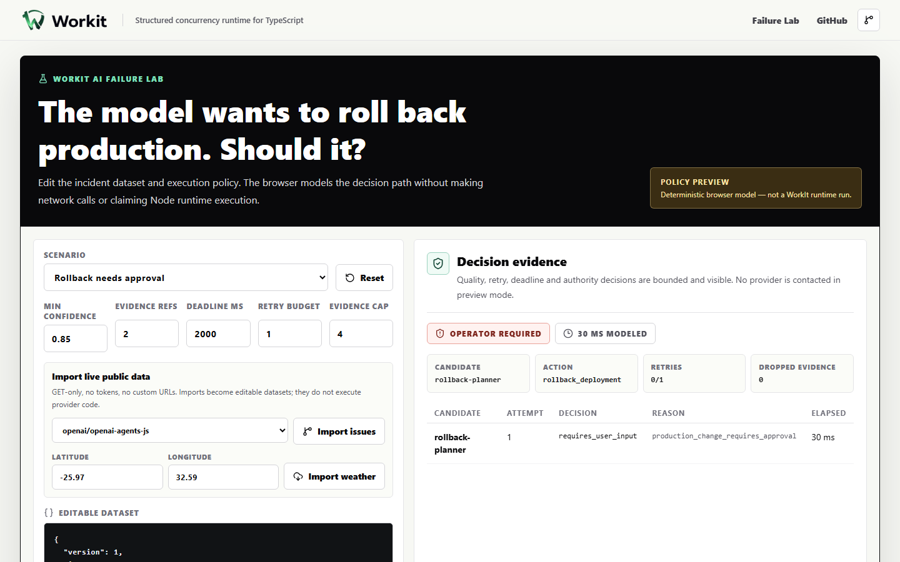

<!--
Author: Admilson B. F. Cossa
SPDX-License-Identifier: Apache-2.0
-->

<p align="center">
  
</p>

# WorkIt

WorkIt gives related asynchronous work one owner. A request, batch, agent run,
provider chain, or background operation can share cancellation, deadlines,
retry budgets, cleanup, context, and lifecycle evidence instead of rebuilding
those contracts around disconnected promises.

[](LICENSE)
[](https://www.npmjs.com/package/@workit/core)
[](packages/core/package.json)
[](https://www.bestpractices.dev/projects/12807)

Native `Promise` remains the right primitive for one asynchronous value. WorkIt
is for the point where several values must start, fail, stop, and clean up as
one operation.

[**Try the AI Failure Lab**](https://workruntime.github.io/workit/?example=incident-decision-gate&scenario=approval-stop#failure-lab)
· [Technical documentation](packages/core/README.md)
· [npm package](https://www.npmjs.com/package/@workit/core)

<p align="center">
  
</p>

## Success Is Not Acceptance. Acceptance Is Not Authority.

The AI Failure Lab makes that boundary executable with deterministic incident
fixtures:

| Candidate result | Runtime decision |
|---|---|
| Fulfilled candidate, confidence `0.97`, no operational evidence | `quality_rejected` |
| Transient provider failure | `retry_same_candidate`, charged to one shared retry budget |
| Grounded read-only recommendation | `accepted` |
| Grounded production rollback | `requires_user_input` before the mutation |

In the authority scenario, the later unsafe fallback is never admitted and the
recorded number of production changes is zero. The browser labels its immediate
result as a **policy preview**; it does not claim to execute the Node.js runtime
or contact an AI provider.

The confidence values and evidence references are deterministic fixture inputs,
not calibrated model scores or proof of factual truth. WorkIt exposes the
decision boundary; application authorization and external side effects remain
caller-owned.

Run the same tracked datasets through the published `@workit/core@0.6.1`
package in Node.js:

```sh
git clone https://github.com/WorkRuntime/workit.git
cd workit/examples/ai-failure-lab
npm ci --no-audit --no-fund
npm test
npm start
```

The scenario contract, deterministic preview, real runtime path, and parity
tests live in [`examples/ai-failure-lab`](examples/ai-failure-lab). The
production-shaped WorkIt sample is
[`incident-decision-gate.sample.js`](packages/core/samples/incident-decision-gate.sample.js).

## What WorkIt Owns

- scope trees and child task lifecycles;
- typed cancellation propagation and cancel-aware backoff;
- cleanup ordering through defer and bracket boundaries;
- bounded parallelism and backpressured streams;
- aggregate deadlines, retries, and caller-defined budgets;
- candidate quality, failure disposition, and human-input stops;
- bounded lifecycle events, receipts, diagnostics, and OpenTelemetry bridges.

The complete API, examples, explicit limitations, bundle measurements, and
evidence commands are maintained in the
[`@workit/core` README](packages/core/README.md).

## Install

```sh
npm install @workit/core
```

```ts
import { run, work } from "@workit/core";
```

WorkIt is Apache-2.0 licensed. Contributions are welcome through issues and
pull requests; please follow [`CONTRIBUTING.md`](CONTRIBUTING.md) and
[`CODE_OF_CONDUCT.md`](CODE_OF_CONDUCT.md).

## Runtime Boundaries

- WorkIt currently targets Node.js server runtimes (`>=20.11`). Browser and
  edge imports resolve to an explicit unsupported-runtime boundary.
- Cancellation is cooperative. Task bodies and providers must observe the
  supplied `AbortSignal`; WorkIt does not forcibly terminate arbitrary code.
- Browser lab results are deterministic previews. The standalone Node project
  is the real WorkIt execution path.
- Candidate evidence is bounded and redacted, but WorkIt is not a security
  sandbox. Provider credentials and arbitrary side effects remain application
  responsibilities.
- Terminal activity replay does not resume an in-flight workflow, and candidate
  execution does not provide durable idempotency for external side effects.

## Versioning

WorkIt follows semver with a stricter release discipline:

- Patch releases, such as `0.1.x`, are for fixes, build/release hardening,
  layout migrations, documentation, and evidence updates. They must not add new
  public runtime APIs.
- Minor releases, such as `0.2.0`, may add new subpaths or feature families when
  they are backed by tests, evidence, package-consumer checks, and
  documentation.
- The root `@workit/core` import remains size-disciplined. New heavier
  capabilities should live in subpaths or companion packages.
- `1.0.0` will mark a frozen public API and long-term compatibility policy, not
  a shortcut for credibility. Current `0.x` releases are validated and usable,
  with changes managed through semver and release notes.

## Citation

If you use WorkIt in research, benchmarks, or reproducible artifacts, please
cite the software release you used:

```bibtex
@software{workit2026,
  author = {Admilson B. F. Cossa},
  title = {WorkIt: A TypeScript Structured Concurrency Runtime for Node.js Server Runtimes},
  year = {2026},
  url = {https://github.com/WorkRuntime/workit},
  version = {0.6.1},
  license = {Apache-2.0}
}
```

## Repository Layout

This repository uses a monorepo layout. The published package contract is still
owned by `packages/core`.

| Path | Purpose |
|---|---|
| `packages/core` | Source, tests, samples, evidence, benchmarks, and release scripts for `@workit/core`. |
| `apps/use-cases-site` | GitHub Pages site with executable WorkIt examples. |
| `articles` | Public article drafts and released article materials. |

## Package Contract

The monorepo layout must not change how users install or import WorkIt.

The supported consumer paths are listed below. The candidate-policy subpath has
been available from npm since `0.6.0`.

```txt
@workit/core
@workit/core/activity
@workit/core/ai
@workit/core/analysis
@workit/core/candidates
@workit/core/channel
@workit/core/contracts
@workit/core/diagnostics
@workit/core/fault
@workit/core/ledger
@workit/core/observability
@workit/core/otel
@workit/core/replay
@workit/core/resources
@workit/core/time-policy
@workit/core/worker
```

## Verification

Run the core gates from the repository root:

```sh
npm run verify
npm run test:coverage
npm run check:size
npm run check:package-consumer
npm run check:api-declarations
npm run check:compat-previous
npm run check:pack-reproducibility
```

The candidate-policy subpath is documented in the
[`@workit/core` package README](packages/core/README.md#candidate-selection).

Run the site gates from the repository root:

```sh
npm run site:build
```
